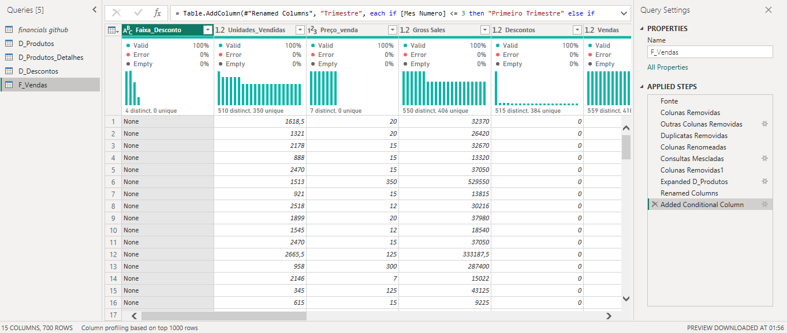
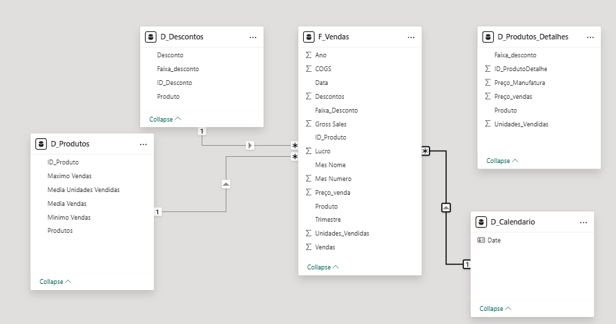

📊 Repositório de Estudos – Business Intelligence com Power BI

Este repositório reúne o conteúdo desenvolvido durante o curso Power BI Analyst, incluindo modelagem dimensional, construção de dashboards profissionais, práticas de ETL/ELT, SQL Analytics e criação de relatórios gerenciais.

O objetivo é consolidar o aprendizado, documentar processos técnicos e apresentar entregas diretas para recrutadores e equipes de dados.

---

## 📂 Conteúdos do Repositório

### 📝 **PowerBI1.pptx — Dashboard Inicial de Vendas**
Análise exploratória contendo:
- Vendas por produto, país e segmento  
- Lucro total e por categoria  
- Mapas geográficos e gráficos comparativos  
- Primeira estrutura prática de um dashboard analítico  

---

### 🧾 **PowerBI2.pptx — Relatório Gerencial Completo**
Relatório multi-páginas com:
- KPIs principais (Vendas, Lucro, Unidades Vendidas)  
- Segmentadores com ícones e calendário  
- Navegação via botões e bookmarks  
- Gráficos de linha, área, barras, hierarquias e mapa  
- Página detalhada de análise de Lucro por Ano, País, Trimestre e Segmento

### 🧾 **PowerBI4.pptx — Dashboard Gerencial para Tomada de Decisão**

Projeto desenvolvido a partir de um desafio prático focado na experiência do usuário e storytelling com dados, aplicando boas práticas de design, performance e análise gerencial.

Principais entregas:

- Relatório de vendas e lucros
- Uso de segmentadores, botões e navegação entre páginas
- Análises temporais para identificação de tendências
- Visualização de exceções e distribuição dos dados
- Aplicação de indicadores para navegação e apresentação
- Otimização de performance utilizando Performance Analyzer

###🧾 **PowerBI5.pptx — Dashboard Gerencial com Parâmetros e Storytelling Avançado**

Evolução direta do PowerBI4, este projeto foi desenvolvido a partir de um desafio prático focado em **interatividade, personalização da análise e apresentação orientada ao cliente**, utilizando **Parâmetros de Campos** no Power BI.

O objetivo foi permitir que o usuário final explore os dados sob diferentes perspectivas sem duplicação de visuais, reforçando a experiência do usuário e a tomada de decisão.

Principais entregas:

- Criação de **parâmetros baseados em categorias** (ex: Country, Product, Trimestre)
- Criação de **parâmetros baseados em valores** (ex: Profit, Sales, métricas financeiras)
- Visuais dinâmicos controlados por parâmetros
- Página dedicada com **storytelling**, seguindo padrão visual do relatório
- Navegação intuitiva e layout orientado à apresentação executiva
- Análise comparativa e identificação de exceções
- Continuidade da otimização de performance e boas práticas de design

Este relatório foi concebido como uma **página de apresentação ao cliente**, priorizando clareza, consistência visual e leitura executiva dos dados.
---

## 🧩 Modelagem Dimensional — Star Schema de Vendas

Para suportar o relatório final, foi construída uma modelagem dimensional completa baseada nas práticas de Kimball.

### 🏗️ Estrutura do Modelo

### **Tabela Fato — F_Vendas**
Contém dados observacionais:
- Units Sold  
- Sale Price  
- Discounts  
- Sales  
- COGS  
- Profit  
- Country, Segment e Product  
- Data da venda  
- Chave substituta criada via Power Query  

### **Tabelas Dimensão**
- **D_Produtos** – lista única de produtos  
- **D_Produtos_Detalhes** – agregações (média, mínimo e máximo por produto)  
- **D_Descontos** – faixas e percentuais de desconto  
- **D_Calendário** – criada em DAX via `CALENDAR()`  
- **D_Segmento / D_País** – derivadas dos agrupamentos da fato  

---

## 🧪 Transformações no Power Query  
Abaixo está uma das etapas fundamentais do processo de ETL, incluindo geração de colunas condicionais, limpeza de dados, criação do índice de produtos e preparação das tabelas dimensão:

---

## 🗺️ Modelo Dimensional Final no Power BI  
Após criar todas as dimensões no Power Query e estabelecer a granularidade correta, o modelo Star Schema foi estruturado no Power BI Desktop da seguinte forma:

---

## 🔧 Processo de Construção do Modelo (Resumo Técnico)

1️⃣ **Transformações no Power Query**
- Remoção de colunas redundantes  
- Agrupamentos por Produto  
- Cálculo de métricas (Média, Máx., Mín.)  
- Criação da chave substituta (Índice de Produtos)  
- Geração da dimensão D_Produtos_Detalhes  
- Padronização de tipos de dados  

2️⃣ **Criação da Tabela Calendário (DAX)**

3️⃣ Modelagem Dimensional

Relacionamentos 1:* entre dimensões e fato

Direcionalidade correta dos filtros

Garantia de granularidade consistente

4️⃣ Construção do Relatório

KPIs com DAX

Bookmarks e navegação

Segmentadores avançados

Páginas temáticas e storytelling visual

🧠 Conceitos Consolidados
🔹 Business Intelligence

Dashboards orientados a decisões

KPIs e leitura executiva

Storytelling com dados

🔹 ETL / ELT

Transformações no Power Query

Limpeza, normalização e padronização

🔹 SQL Analytics

Estruturação de esquemas relacionais

Manipulação e análise de dados

🔹 Modelagem Dimensional

Star Schema

Chave substituta

Cardinalidade e granularidade

🎯 Objetivo do Projeto

Este repositório foi criado para:

Demonstrar domínio de Power BI, Power Query, DAX e SQL

Apresentar um pipeline completo de dados

Consolidar boas práticas de BI e modelagem dimensional

Servir como portfólio profissional para vagas de BI, FP&A e Data Analytics

🚀 Tecnologias Utilizadas

Power BI Desktop

Power Query (M Language)

DAX

MySQL Workbench

SQL Analytics

Azure / SQL Server / PowerPoint

👤 Autor

Vinicius Borges
Analista de Dados | BI | FP&A
Transformando dados em decisões estratégicas.
