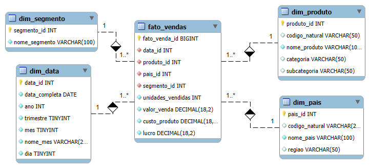

# 📊 Repositório de Estudos – Business Intelligence com Power BI

Este repositório reúne todo o conteúdo estudado no curso de Business Intelligence utilizando Power BI Desktop, incluindo:

- Painéis e apresentações desenvolvidas ao longo das aulas  
- Um relatório gerencial completo criado como desafio final  
- Conceitos fundamentais de BI, SQL Analytics e processos ETL/ELT  
- Práticas de modelagem, navegação, storytelling e visualização de dados  

O objetivo é registrar a evolução dos estudos, consolidar materiais para revisão futura e construir um portfólio profissional de projetos em Power BI.

---

## 📂 Conteúdos do Repositório

### 📝 PowerBI1.pptx – Analisando Dados de um Dashboard de Vendas no Power BI
Apresentação com visuais iniciais explorando vendas, lucro, produtos, países e segmentos.  
Representa a introdução ao uso do Power BI e à construção de dashboards básicos.

### 🧾 PowerBI2.pptx – Relatório Gerencial Completo
Apresentação contendo o relatório desenvolvido a partir do dataset *Sample Financials*, incluindo:

- Página principal com KPIs de Vendas, Lucro e Unidades Vendidas  
- Botões de navegação entre páginas  
- Segmentadores com ícones e seleção de datas  
- Bookmarks e botões para alternar visuais sobre o mesmo tema  
- Gráficos avançados: linha, área, treemap, mapa, barras, pizza  
- Página analítica de lucro com detalhamento por ano, país, trimestre e segmento  

---

## 🧩 Modelagem Dimensional – Star Schema de Vendas

Para dar suporte ao relatório gerencial foi criado um **modelo dimensional (Star Schema)** estruturado para otimizar análises de vendas, lucro e desempenho comercial.

Esse modelo permite:

- Melhor performance nas consultas  
- Cálculos DAX mais eficientes  
- Navegação clara entre dimensões e fatos  
- Análises por tempo, produto, país, região e segmento  

### 📐 Estrutura do Modelo

**Tabela Fato**
- `fato_vendas` – contém métricas como:  
  - `unidades_vendidas`  
  - `valor_venda`  
  - `custo_produto`  
  - `lucro`  

**Tabelas Dimensão**
- `dim_data` – hierarquia de datas (dia, mês, trimestre, ano).  
- `dim_produto` – nome do produto, categoria e subcategoria.  
- `dim_pais` – país, código e região.  
- `dim_segmento` – segmentos de mercado (Government, Enterprise, Small Business etc.).

Essa estrutura suporta análises temporais, geográficas e categóricas de forma otimizada.

### 🗺️ Diagrama do Modelo (EER)

O diagrama abaixo foi gerado no MySQL Workbench para documentar a modelagem utilizada:

### 🧱 Script SQL do Modelo

O repositório também inclui o arquivo com o **esquema SQL completo**, contendo todas as tabelas, chaves primárias, estrangeiras e índices necessários para montar o Star Schema em um banco MySQL.

---

## 🧠 Conceitos Estudados

### 🔹 Business Intelligence

Conceitos fundamentais de BI, com foco em dashboards orientados a decisões:

- Soma de Vendas por Produto  
- Média de Preço  
- Lucro por Segmento  
- Vendas por País  
- Análises temporais (Ano, Mês, Trimestre)  
- Mapas geográficos  

### 🔹 Processos de Dados – ETL e ELT

- Diferenças estruturais e fluxo de execução  
- Transformação antes e depois do carregamento  
- Boas práticas de desempenho, manutenção e integração  

### 🔹 Análises de Dados

- **Descritiva**  
- **Diagnóstica**  
- **Preditiva**  
- **Prescritiva**  

Incluindo exercícios de categorização, padronização, segmentação e criação de métricas.

### 🔹 SQL Analytics

- Mindset analítico aplicado ao SQL  
- Transformações e manipulação de dados  
- Boas práticas para consultas em ambiente de produção (LIMIT, padronização etc.)

### 🔹 Power BI

- Carregamento e transformação de dados (Power Query)  
- Modelagem analítica  
- Construção de visuais adequados a tendência, magnitude, composição e comparação  
- Criação de relatórios multi-página  
- Botões de navegação e bookmarks  
- Segmentadores avançados  
- Publicação no Power BI Service  

---

## 🎯 Objetivo do Projeto

Este repositório foi criado para:

- Registrar todo o aprendizado do curso *Power BI Analyst*  
- Construir um portfólio sólido com dashboards e relatórios profissionais  
- Desenvolver storytelling com dados e visualização orientada ao negócio  
- Consolidar conceitos fundamentais de BI, ETL/ELT, SQL Analytics e modelagem dimensional  

---

## 🚀 Tecnologias Utilizadas

- Power BI Desktop  
- Power Query (M Language)  
- DAX  
- SQL / SQL Analytics  
- MySQL Workbench  
- Ferramentas Microsoft (Azure, SQL Server, PowerPoint)

---

## 📣 Contribuições

Este repositório é focado em estudos individuais, mas sugestões podem ser enviadas via **Issues**.  
Feedbacks e recomendações são sempre bem-vindos.

---

## 👤 Autor

**Vinicius Borges**  
Analista de Dados | BI | FP&A  
Apaixonado por transformar dados em decisões inteligentes.

---

## 🔗 Contato

Caso queira trocar ideias sobre BI, FP&A ou modelagem de dados:

- LinkedIn: _adicione seu link aqui_  
- GitHub: _adicione seu link aqui_  
