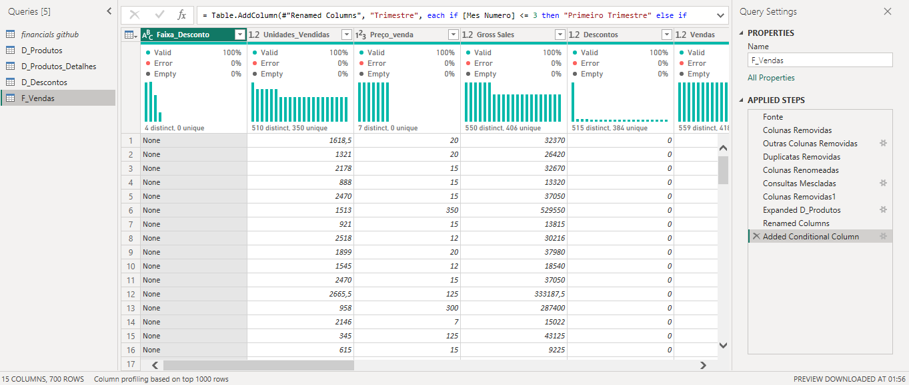
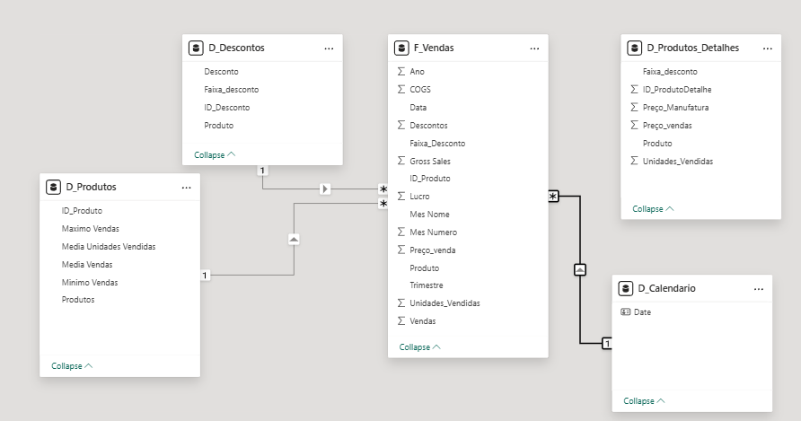

# 📊 Business Intelligence aplicado à análise de performance

## 📌 Contexto

Em muitos cenários, o desafio não é ter dados —  
é conseguir transformá-los em uma visão clara de performance.

Este projeto simula a construção de um ambiente de Business Intelligence voltado para análise de vendas, com foco em organização dos dados, visualização de indicadores e suporte à tomada de decisão.

---

## 🎯 Objetivo

Estruturar um pipeline completo de dados e desenvolver dashboards capazes de:

- Monitorar performance de vendas  
- Identificar tendências e variações  
- Analisar lucratividade por diferentes dimensões  
- Apoiar decisões com base em indicadores  

---

## 🧠 Abordagem

A construção do projeto seguiu uma lógica orientada a negócio:

- Tratamento e organização dos dados (Power Query)  
- Estruturação do modelo dimensional (Star Schema)  
- Criação de métricas e KPIs com DAX  
- Desenvolvimento de dashboards com foco em leitura executiva  
- Aplicação de storytelling para facilitar interpretação  

---

## 📊 Principais análises

O projeto permite explorar a performance sob diferentes perspectivas:

- Vendas e lucro por produto, país e segmento  
- Evolução temporal (ano, trimestre, período)  
- Identificação de padrões e exceções  
- Comparação entre categorias e regiões  

---

## 💡 Valor gerado

A estrutura construída permite:

- Visualização clara da performance do negócio  
- Identificação de tendências e oportunidades  
- Apoio à tomada de decisão baseada em dados  
- Melhor comunicação de indicadores para stakeholders  

---

## 🧩 Modelagem de dados

Foi construída uma modelagem dimensional baseada em Star Schema, garantindo:

- Organização e escalabilidade  
- Separação entre fatos e dimensões  
- Melhor performance das análises  

### Estrutura principal:

- **F_Vendas** → métricas de venda e lucro  
- **Dimensões** → produto, calendário, país, segmento e descontos  

---

## ⚙️ Construção técnica (visão resumida)

- Transformações no Power Query (limpeza, padronização, criação de colunas)  
- Criação de tabela calendário em DAX  
- Relacionamentos e cardinalidade (1:*)  
- Desenvolvimento de KPIs e medidas  
- Uso de bookmarks, segmentadores e navegação  

---

## 📊 Exemplos do modelo

### Transformações no Power Query

### Modelo dimensional

---

## 🚀 Evolução dos dashboards

O projeto foi desenvolvido em etapas:

- Dashboard inicial exploratório  
- Relatório gerencial com KPIs e navegação  
- Dashboard com storytelling e foco em decisão  
- Versão avançada com parâmetros dinâmicos e personalização  

---

## 📈 Conclusão

O projeto demonstra como a combinação de modelagem de dados, visualização e análise pode transformar dados brutos em informações úteis para tomada de decisão.

Mais do que construir dashboards, o foco está em criar **clareza sobre a performance do negócio**.

---

## 🛠️ Tecnologias utilizadas

Power BI • Power Query • DAX • SQL  

---

## 👤 Sobre mim

Atuo na interseção entre **finanças, dados e tecnologia**, com foco em análise de performance e apoio à decisão.

---

## 📌 Observações

Projeto desenvolvido para fins de portfólio.
